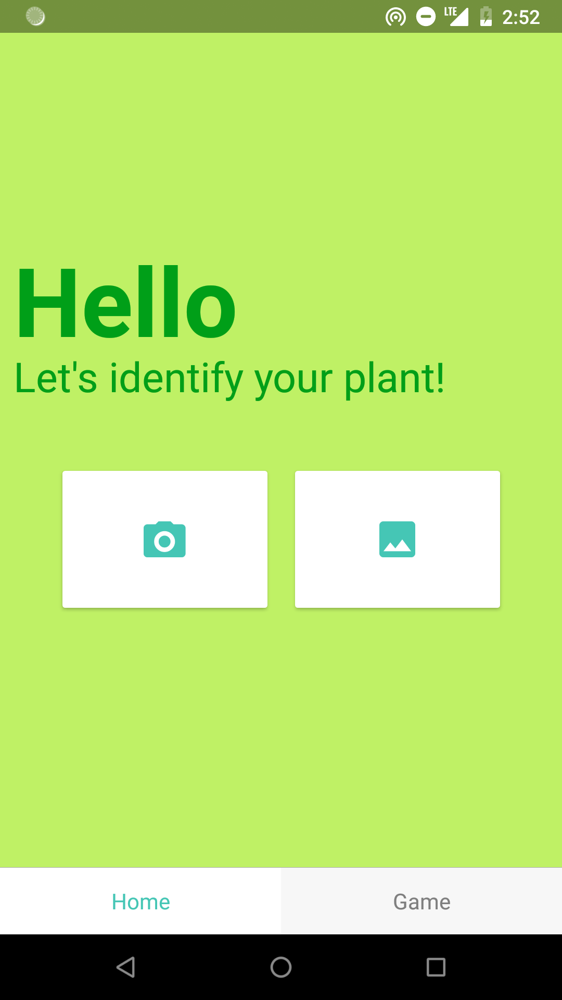
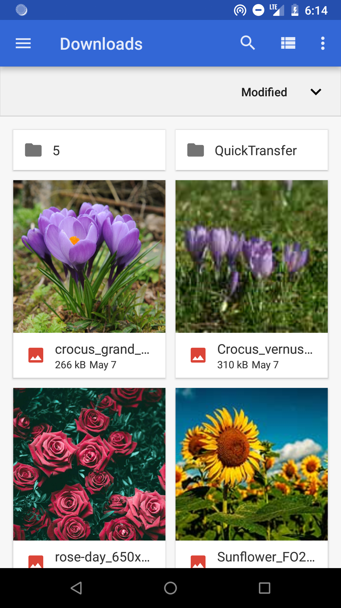
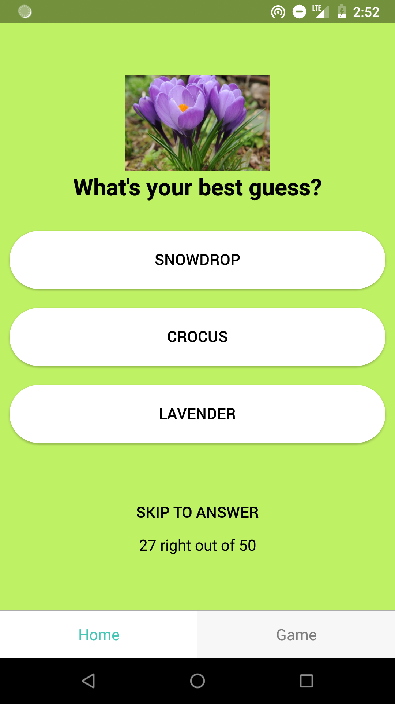
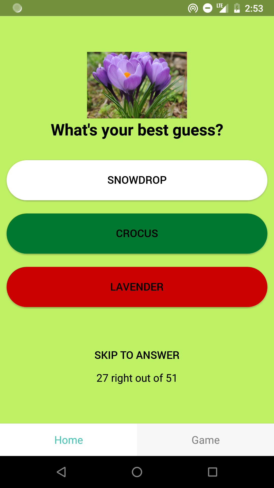
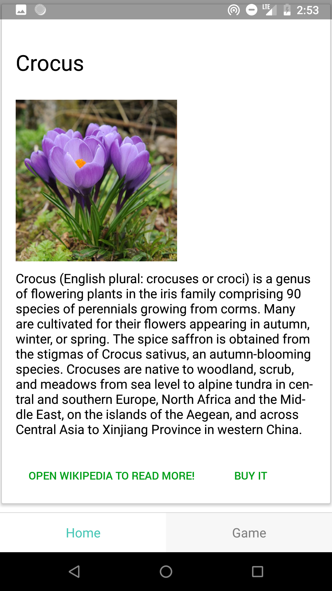
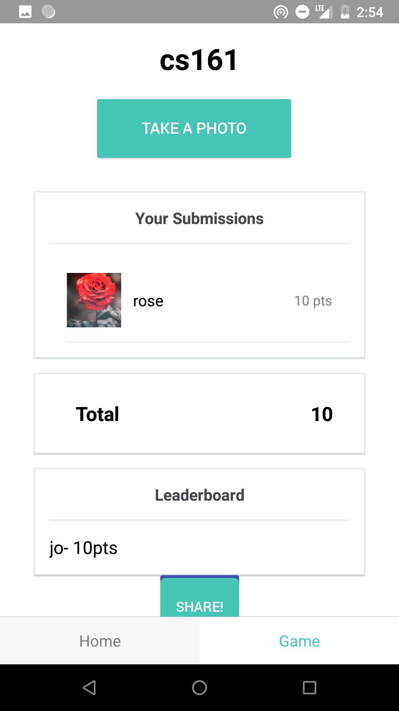
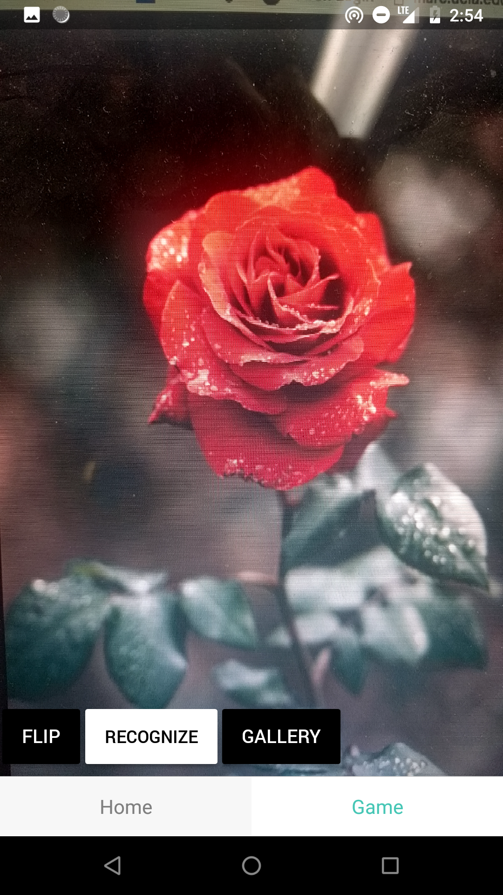

Plant Identifier
=====

A mobile app to recognize plants from pictures of flowers. This app was built as part of our software project class using Tensorflow's Image recognition.

Home Tab           | Open Gallery                   | Mini Guessing game              | Wrong guess                 | Plant Information Page
:-------------------------:|:-------------------------:|:-------------------------:|:-------------------------:|:-------------------------:
  |   |         |                     | 

Game Tab           |  Joined a room                 |   Take a photo             
:-------------------------:|:-------------------------:|:-------------------------:
  |  |  

Used
====

* React Native
* Tensorflow
* Firebase
* Native Base
* Expo
* create-react-native-app
* MediaWiki

Authors
======
Pearl Or  
Jonnel Alcantara  
Joanitha Christle Gomez  

License
=======
This project is licensed under the MIT License - see the [LICENSE](LICENSE) file for details

Acknowledgements
==============

* https://codelabs.developers.google.com/codelabs/tensorflow-for-poets/index.html#0
* Prof. Jahan Ghofraniha for his guidance.
